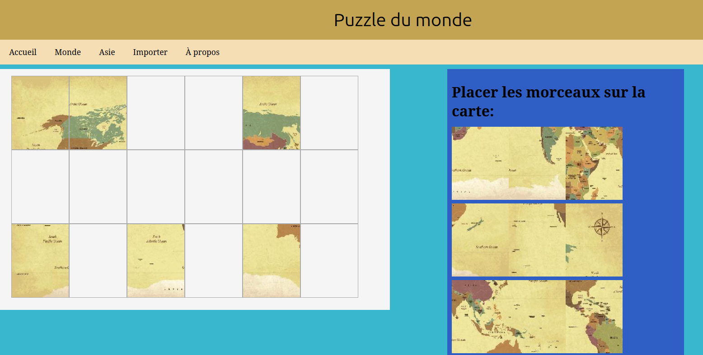

# 🧩 Puzzle Interactive Web

Un site web interactif permettant de résoudre des puzzles en utilisant la technologie **drag and drop**. Le projet utilise Flask en backend et HTML/CSS/JavaScript en frontend, avec la possibilité d'importer et de traiter des images personalisées.



---

## 📋 Fonctionnalités

-  **Résolution interactive de puzzles** avec système drag and drop
-  **Multiple niveaux de difficulté** (Facile, Moyen, Difficile)
-  **Import d'images personnalisées** pour créer vos propres puzzles


---

## 🛠️ Technologies Utilisées

- **Backend**: Python, Flask
- **Frontend**: HTML5, CSS3, JavaScript (Vanilla)
- **Traitement d'images**: Python (librairie Flax)
- **Responsive Design**: CSS avec Media Queries et unités adaptatives

---

## 📦 Installation

### Prérequis
- Python 3.7+
- pip (gestionnaire de paquets Python)

### Étapes d'installation

1. **Cloner ou télécharger** le projet

2. **Installer les dépendances**
```bash
pip install -r requirements.txt
```

3. **Lancer le serveur**
```bash
python app.py
```

4. **Accéder au site**
   - Ouvrir votre navigateur et aller à `http://localhost:5000`

---

## 📝 Notes

- Le design est susceptible de changer et s'améliorer
- Ajouts de nouvelles fonctionnalités et améliorations du gameplay dans le futur (chronomètre, ajustement de la difficulté, ...)
- Le site est actuellement disponible localement
- Les images importées doivent être au format PNG ou JPG


**Dernière mise à jour**: 29 août 2026